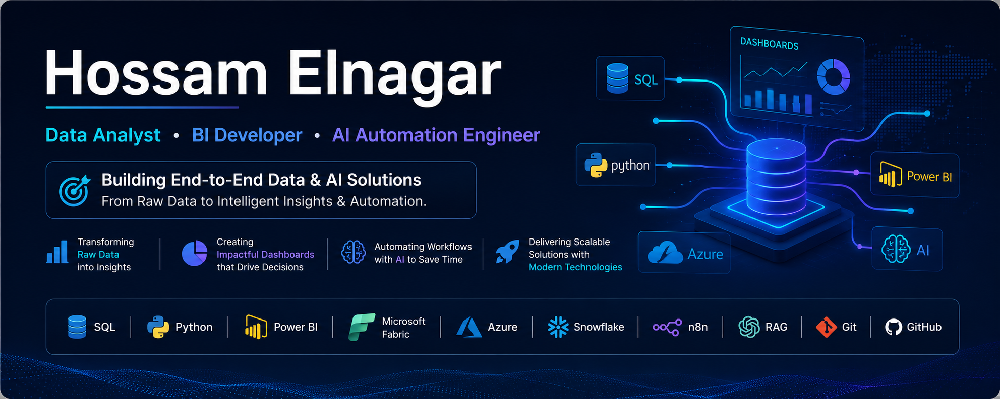

# Hi 👋, I'm Hossam Elnagar

### Data Analyst • BI Developer • AI Automation Engineer

### Building End-to-End Data & AI Solutions — From Raw Data to Intelligent Insights & Automation.

## 👨‍💻 About Me

I'm **Hossam Elnagar**, a **Data Analyst**, **BI Developer**, and **AI Automation Engineer** passionate about transforming raw data into meaningful insights and intelligent solutions.

My work focuses on the complete data journey—from collecting and preparing data to building interactive dashboards, developing machine learning models, and creating AI-powered automation workflows that solve real-world business problems.

I enjoy combining **SQL**, **Python**, **Power BI**, **Microsoft Fabric**, **Azure**, and **AI technologies** to deliver scalable, data-driven solutions and continuously expand my expertise in modern Data & AI ecosystems.

## 🚀 Professional Profile

<table>
<tr>
<td width="50%">

### 🎯 Current Role

- 📊 Data Analyst
- 📈 BI Developer
- 🤖 AI Automation Engineer

### 🌱 Currently Learning

- Microsoft Azure
- Azure AI Services
- Microsoft Fabric
- AI Automation
- Machine Learning

</td>

<td width="50%">

### 💡 Specializations

- 📊 Exploratory Data Analysis (EDA)
- 🧹 Data Cleaning & Preprocessing
- 📈 Interactive Power BI Dashboards
- 🗄 SQL Database Solutions
- 🤖 Retrieval-Augmented Generation (RAG)
- ⚙️ AI Automation with n8n

</td>
</tr>
</table>

## 🛠️ Tech Stack

### 📊 Data Analytics

### 📈 Business Intelligence

### 🗄️ Databases

### ☁️ Cloud & Data Platform

### 🤖 AI & Machine Learning

### ⚙️ Development Tools

